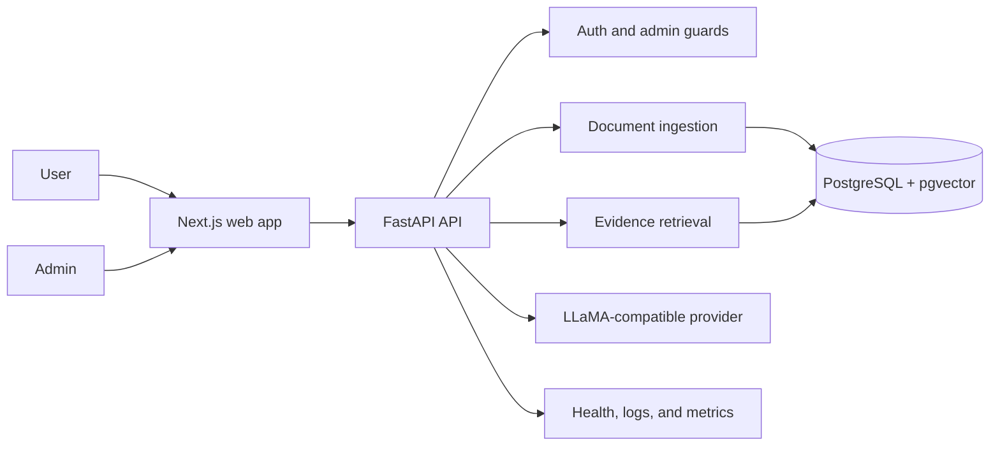

# GroundStack

GroundStack is a document-grounded AI support app: upload approved technical documents, ask questions about them, and get answers with source citations instead of unsupported chatbot guesses.

It is built as an undergraduate software-engineering portfolio project for reviewers who want to see a complete full-stack application with clear trust boundaries, local setup, tests, and honest limitations.

GroundStack does not claim production deployment, real user traffic, public Discord adoption, completed fine-tuning, uptime, cost savings, or hosted-provider scale. Evidence-backed claims are tracked in [docs/claims/CLAIMS.md](docs/claims/CLAIMS.md).

## Project Highlights

- Full-stack TypeScript/Python app with a Next.js web interface and FastAPI backend.
- Admin-only document ingestion for Markdown, text, HTML, text-based PDF, and allowlisted documentation URLs.
- PostgreSQL with pgvector for document, chunk, conversation, citation, and feedback storage.
- Grounded answer flow that retrieves source chunks, streams an answer, validates citations, and returns an insufficient-evidence response when the uploaded material does not support an answer.
- Clear user experience for uploading documents, asking questions, inspecting citations, and browsing source passages.
- Security-oriented boundaries for authentication, admin routes, URL ingestion, secret handling, and demo-mode limits.
- Portfolio-ready engineering evidence: tests, migrations, Docker Compose config, CI, secret scanning, dependency audits, backup/restore coverage, and documented limitations.

## Who It Serves

GroundStack is for maintainers, support engineers, student teams, and developer communities that want an assistant constrained to a known documentation set. The current public-facing workflow is intentionally focused:

1. Upload an approved technical document.
2. GroundStack extracts text, chunks it, and stores searchable source records.
3. Ask a question about the uploaded material.
4. Review the answer and the exact source passages used.
5. Receive an insufficient-evidence response when the documents do not support an answer.

## Architecture



Core parts:

- `apps/web`: Next.js App Router UI for the landing page, chat, source inventory, document management, settings, and health visibility.
- `apps/api`: FastAPI backend for auth, ingestion, retrieval, generation, feedback, document APIs, health checks, and operational routes.
- `apps/api/migrations`: Alembic migrations for PostgreSQL/pgvector-backed storage.
- `docker-compose.yml`: local PostgreSQL with pgvector.
- `deploy/`: demo-oriented deployment notes and Compose assets with placeholders only.
- `tests/`, `load/`, `evaluation/`, and `training/`: verification utilities and advanced evidence workflows. These are documented, but they are not presented as live production results.

## How It Works

1. An administrator uploads files or submits an allowlisted documentation URL.
2. The API validates file type, size, URL safety, and authentication.
3. Ingestion extracts text, creates chunks, stores document versions, and records chunk metadata in PostgreSQL/pgvector.
4. A user asks a question in the web app.
5. The backend retrieves relevant source chunks and sends only grounded context to the configured LLaMA-compatible provider.
6. The streamed answer includes source references. The source viewer shows the exact passage behind each citation.
7. If there is not enough supporting evidence, GroundStack returns an insufficient-evidence response rather than inventing an answer.

## Local Setup

Prerequisites:

- Node.js 22 or newer
- npm 10 or newer
- Python 3.12
- Docker Desktop or another Docker Compose-compatible runtime
- Optional: Ollama or another OpenAI-compatible local/provider endpoint for generation

```bash
cp .env.example .env
make setup
make db-up
make migrate
make dev
```

The API runs at `http://localhost:8000`; the web app runs at `http://localhost:3000`.

Useful local commands:

```bash
make api-dev
make web-dev
make ingest-sample
make migration-check
make predeploy
```

Configuration is documented in [.env.example](.env.example) and [docs/deployment/ENVIRONMENT_VARIABLES.md](docs/deployment/ENVIRONMENT_VARIABLES.md). Example files use placeholders only and must not contain real secrets.

## Verified Testing Commands

These commands are the intended local and CI-style checks. Some require Docker, PostgreSQL client utilities, or network access for dependency audits.

```bash
git diff --check

cd apps/api
ruff format --check app tests ../../load ../../scripts ../../tests
ruff check app tests ../../load ../../scripts ../../tests
python -m compileall -q app ../../load ../../scripts
pytest

cd ../..
python scripts/check_migrations.py
python scripts/secret_scan.py --self-test
python scripts/secret_scan.py
PYTHONPATH=. python -m pytest tests/load

npm run lint --workspace apps/web
npm run typecheck --workspace apps/web
npm run test --workspace apps/web
npm run test:e2e --workspace apps/web
npm run build --workspace apps/web
npm audit --audit-level=high
docker compose -f docker-compose.yml config
```

Release-candidate evidence is summarized in [docs/reports/FINAL_RELEASE_AUDIT.md](docs/reports/FINAL_RELEASE_AUDIT.md) and [docs/RELEASE_CHECKLIST.md](docs/RELEASE_CHECKLIST.md).

## Security And Privacy

- Administrative document management requires an authenticated admin role.
- Anonymous/demo access, when enabled, is limited to controlled chat flows and cannot upload documents or change settings.
- URL ingestion is allowlist-based and rejects embedded credentials, private IP ranges, redirects, unsupported content types, and oversized responses.
- Uploaded/private documents, processed datasets, database volumes, model weights, adapters, secrets, caches, logs, coverage, and build outputs are excluded from version control.
- Source text is treated as untrusted evidence, not application instructions.
- AI security documentation was reviewed against [OWASP GenAI LLM Top 10 2026](https://genai.owasp.org/resource/owasp-genai-llm-top-10-2026/), released August 3, 2026. The repository does not claim complete 2026 compliance.

See [docs/security/THREAT_MODEL.md](docs/security/THREAT_MODEL.md), [docs/security/AI_SECURITY_REVIEW.md](docs/security/AI_SECURITY_REVIEW.md), [docs/security.md](docs/security.md), and [docs/PRIVACY_AND_DATA_GOVERNANCE.md](docs/PRIVACY_AND_DATA_GOVERNANCE.md).

## Evaluation And Reliability

GroundStack includes deterministic test suites, CI configuration, backup/restore coverage, migration checks, secret scanning, dependency audits, and safe load-harness profiles. Benchmark evidence is synthetic or local unless a document explicitly says otherwise. The project does not claim production throughput, live hosted-provider latency, or real community usage.

Useful references:

- [docs/claims/CLAIMS.md](docs/claims/CLAIMS.md)
- [docs/load-testing.md](docs/load-testing.md)
- [docs/benchmarks/CAPACITY_REPORT.md](docs/benchmarks/CAPACITY_REPORT.md)
- [docs/KNOWN_LIMITATIONS.md](docs/KNOWN_LIMITATIONS.md)
- [docs/OPERATIONS_RUNBOOK.md](docs/OPERATIONS_RUNBOOK.md)

## Limitations

- No production deployment or real user traffic is claimed.
- The default local setup depends on local services and placeholder configuration.
- Hosted LLM cost, latency, quality, and availability require separate provider-specific testing.
- Uploaded documents must be approved by the project owner; no scraped, private, or copyrighted corpus is included as demo data.
- Background ingestion uses local app infrastructure in development; production deployments should use managed infrastructure and stricter operational monitoring.
- Advanced repository areas for Discord, training, evaluation, and launch planning remain documented but are not required for the focused core demo workflow.

## Documentation Map

- Case study: [docs/CASE_STUDY.md](docs/CASE_STUDY.md)
- System overview: [docs/architecture/SYSTEM_OVERVIEW.md](docs/architecture/SYSTEM_OVERVIEW.md)
- Retrieval and generation: [docs/retrieval.md](docs/retrieval.md), [docs/generation.md](docs/generation.md)
- Deployment variables: [docs/deployment/ENVIRONMENT_VARIABLES.md](docs/deployment/ENVIRONMENT_VARIABLES.md)
- Security review: [docs/security/AI_SECURITY_REVIEW.md](docs/security/AI_SECURITY_REVIEW.md)
- Release audit: [docs/reports/FINAL_RELEASE_AUDIT.md](docs/reports/FINAL_RELEASE_AUDIT.md)
- Portfolio package: [docs/portfolio/](docs/portfolio/)
