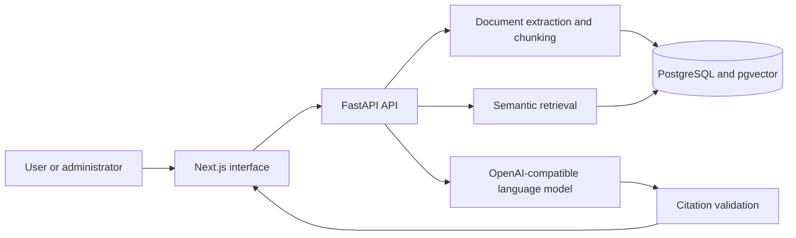

# GroundStack

GroundStack is a private knowledge-support application that answers questions from an
organization's approved documents and shows the source passages behind each answer.

It is an undergraduate software-engineering portfolio project. It does not claim real
customers, production usage, guaranteed privacy, or measured production scale.

## Why It Exists

Policies, procedures, manuals, and technical notes are often spread across many files.
GroundStack gives authorized teams one controlled workflow:

1. An administrator uploads an approved document.
2. GroundStack extracts the text, creates searchable sections, and stores embeddings.
3. A user asks a question.
4. GroundStack retrieves the closest document sections and asks a configured language
   model to answer only from that evidence.
5. The answer includes inspectable citations, or GroundStack states that the evidence is
   insufficient.

## Project Highlights

- Next.js, React, and TypeScript interface with responsive and keyboard-accessible core flows.
- FastAPI and Pydantic API with explicit authentication and administrator boundaries.
- SQLAlchemy and Alembic persistence on PostgreSQL with pgvector.
- File and allowlisted-URL ingestion with size, type, content, and network-safety checks.
- Semantic vector retrieval with a fixed relevance threshold and bounded evidence set.
- Streaming OpenAI-compatible generation with citation validation and honest abstention.
- Persistent conversations and helpful/not-helpful feedback.
- Docker Compose local database, migration checks, CI, dependency audits, and secret scanning.

## Architecture



The runtime is intentionally small: one web app, one API, PostgreSQL with pgvector, an
embedding model, and one configured OpenAI-compatible generation provider.

## Local Setup

Prerequisites:

- Docker Desktop
- Node.js 24 and npm
- Python 3.12 or newer
- Ollama with `llama3.2:3b`, or credentials for an OpenAI-compatible provider

```bash
cp .env.example .env
make setup
make dev
```

`make dev` starts PostgreSQL, waits for it to become healthy, applies all migrations,
then starts the API at `http://localhost:8000` and the web app at
`http://localhost:3000`.

Stop the application with `Ctrl+C`, then stop PostgreSQL without deleting its data:

```bash
make db-down
```

Useful checks:

```bash
curl --fail http://localhost:8000/api/v1/health/live
curl --fail http://localhost:8000/api/v1/health/ready
cd apps/api && .venv/bin/alembic current
```

## Provider Configuration

The default example uses Ollama:

```dotenv
LLM_PROVIDER=ollama
LLM_BASE_URL=http://localhost:11434
LLM_MODEL=llama3.2:3b
LLM_API_KEY=
```

For a hosted provider, set `LLM_PROVIDER=openai_compatible` and enter
`LLM_BASE_URL`, `LLM_MODEL`, and `LLM_API_KEY` privately in `.env`. Never place
a key in a tracked file or browser-visible `NEXT_PUBLIC_*` variable.

## Using GroundStack

1. Open **Documents** as the development administrator.
2. Upload a supported Markdown, plain-text, HTML, or text-based PDF file up to 10 MB.
3. Wait for **Processing** to become **Ready**, then inspect the extracted source passage.
4. Open **Ask**, enter a question answered by the document, and inspect every citation.
5. Ask an unsupported question to verify the insufficient-evidence response.

The knowledge base starts empty. Bring a document you are authorized to process.
There is no seeded corpus or bundled presentation document. The landing-page animation
illustrates the workflow and does not represent stored activity.

## Verification

```bash
make lint
make typecheck
make test
npm run build --workspace apps/web
npm run test:e2e:desktop --workspace apps/web
npm run test:e2e:mobile --workspace apps/web
make migration-check
apps/api/.venv/bin/python scripts/secret_scan.py --self-test
apps/api/.venv/bin/python scripts/secret_scan.py
docker compose config --quiet
git diff --check
```

Browser tests use mocked API responses. Backend generation tests use a deterministic fake
provider. Neither is evidence of a successful external LLM request.

## Security And Privacy

- The API, not only the interface, enforces administrator-only document management.
- The development identity shortcut is accepted only when `APP_ENV=development` and is
  rejected by production configuration validation.
- Uploaded text is treated as untrusted evidence and cannot replace system instructions.
- Citation IDs are accepted only when they correspond to retrieved evidence.
- Secrets, uploaded documents, database volumes, generated output, and model artifacts are
  excluded from Git.
- Privacy depends on access control, hosting, retention, logging, and the selected model
  provider. A hosted provider may receive the retrieved excerpts used for generation.

The security review references the
[OWASP GenAI LLM Top 10 2026](https://genai.owasp.org/resource/owasp-genai-llm-top-10-2026/)
as guidance reviewed on August 19, 2026. GroundStack does not claim complete compliance.

## Limitations

- No real organization or customer activity is represented by the repository.
- A real provider request has not been verified unless the owner supplies a private provider
  configuration and completes the presentation smoke test.
- Local development uses a single administrator identity and is not a production authentication
  setup.
- The knowledge base is shared, not tenant-isolated.
- PDF support is limited to text-based files; scanned images require OCR that is not included.
- Background document processing runs in the API process.
- Process-local rate limits are suitable for one API instance, not a distributed deployment.

See [docs/presentation/PRESENTATION_GUIDE.md](docs/presentation/PRESENTATION_GUIDE.md) for
the presentation sequence, provider setup, and recovery checklist.

## Documentation

- [System overview](docs/architecture/SYSTEM_OVERVIEW.md)
- [Retrieval](docs/retrieval.md)
- [Generation and citations](docs/generation.md)
- [Security review](docs/security/AI_SECURITY_REVIEW.md)
- [Threat model](docs/security/THREAT_MODEL.md)
- [Privacy and data governance](docs/PRIVACY_AND_DATA_GOVERNANCE.md)
- [Operations runbook](docs/OPERATIONS_RUNBOOK.md)
- [Known limitations](docs/KNOWN_LIMITATIONS.md)
