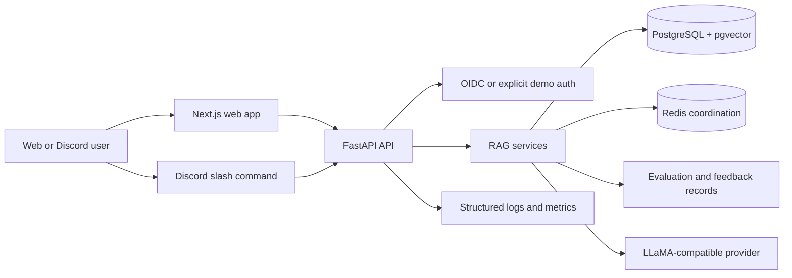

# GroundStack

GroundStack is an AI support assistant for developer communities. It gives teams a
controlled way to answer technical questions from their own documentation instead of
from an unbounded chatbot: sources are ingested into PostgreSQL/pgvector, retrieved
with hybrid search, passed to a LLaMA-compatible generation provider, and checked for
grounded citations before an answer is returned.

The project is built as a portfolio-grade release candidate for engineers and
technical recruiters to review. It demonstrates the parts that make AI support
systems trustworthy in practice: ingestion controls, retrieval quality, citation
validation, authentication boundaries, Discord integration, evaluation, reliability
evidence, deployment preparation, and honest documentation of limits.

GroundStack does not claim production deployment, live Discord adoption, completed
fine-tuning, real usage volume, uptime, cost savings, or hosted-provider performance.
Measured claims live in [docs/claims/CLAIMS.md](docs/claims/CLAIMS.md), and benchmark
evidence lives under [docs/benchmarks/](docs/benchmarks/).

## Project Highlights

- Full-stack AI application with a Next.js web app, FastAPI API, PostgreSQL,
  pgvector, Redis-ready coordination, and Docker deployment assets.
- RAG pipeline with document ingestion, normalization, chunking, embeddings,
  PostgreSQL full-text search, pgvector search, reciprocal-rank fusion, reranking,
  and structured citations.
- Grounded answer streaming with deterministic insufficient-evidence behavior and
  rejection of missing, malformed, or fabricated citations.
- Admin workflows for knowledge-base ingestion, evaluation records, feedback review,
  training-candidate preparation, and Discord operations.
- Release engineering evidence: CI, migrations, dependency audits, secret scanning,
  PostgreSQL backup/restore verification, load-harness dry runs, security review,
  and portfolio documentation.

## Who It Serves

GroundStack is designed for developer communities, docs teams, support engineers, and
maintainers who need AI assistance that stays inside an approved knowledge base. The
Discord integration supports community support workflows, while the web admin
experience supports source management, answer review, evaluation, and operations.

## Architecture



Core components:

- `apps/web`: Next.js App Router interface for chat, source browsing, knowledge
  administration, evaluation views, and Discord administration.
- `apps/api`: FastAPI service with authentication, ingestion, retrieval, generation,
  feedback, evaluation, Discord interaction, observability, and operations routes.
- `docker-compose.yml`: local PostgreSQL with pgvector; deployment compose files add
  API, web, Redis, Caddy, optional Ollama, and optional observability services.
- `training/`: isolated dataset validation, preparation, QLoRA smoke-training, and
  adapter-manifest tooling. It does not include private data or model weights.
- `evaluation/` and `tests/`: deterministic evaluation helpers, API tests, security
  regressions, backup/restore checks, load-harness tests, and frontend tests.

See [docs/architecture/SYSTEM_OVERVIEW.md](docs/architecture/SYSTEM_OVERVIEW.md),
[docs/architecture/RELEASE_INVENTORY.md](docs/architecture/RELEASE_INVENTORY.md),
and [docs/architecture.md](docs/architecture.md).

## How It Works

1. An admin ingests Markdown, text, HTML, text-based PDF, or an allowlisted public URL.
2. The API validates the source, extracts text, normalizes metadata, chunks content,
   embeds chunks, and stores immutable document versions in PostgreSQL/pgvector.
3. A user asks a question through the web app or an explicit Discord slash command.
4. Retrieval combines pgvector semantic search, PostgreSQL full-text search,
   reciprocal-rank fusion, optional reranking, and diversity selection.
5. The API sends only retrieved source blocks to the configured LLaMA-compatible
   provider, such as local Ollama or an OpenAI-compatible `/v1/chat/completions`
   endpoint.
6. The response streams to the client only after citation structure is validated. If
   no evidence is available, GroundStack returns an insufficient-evidence answer
   without calling the LLM.
7. Feedback, evaluation records, metrics, and training-candidate flags are stored for
   review without turning Discord records into training data by default.

## Local Setup

Prerequisites:

- Node.js 22 or newer
- npm 10 or newer
- Python 3.12
- Docker Desktop or another Docker Compose-compatible runtime
- Optional: Ollama for local answer generation

```bash
cp .env.example .env
make setup
make db-up
make migrate
make dev
```

The API runs at `http://localhost:8000`; the web app runs at
`http://localhost:3000`.

For local generation with Ollama:

```bash
ollama pull llama3.2:3b
```

Useful commands:

```bash
make api-dev
make web-dev
make ingest-sample
make eval-retrieval
make benchmark-retrieval
make migration-check
make predeploy
```

Configuration is documented in [.env.example](.env.example) and
[docs/deployment/ENVIRONMENT_VARIABLES.md](docs/deployment/ENVIRONMENT_VARIABLES.md).
The example files intentionally contain placeholders only.

## Verified Checks

These are the local commands used for release-candidate verification. Some checks
require Docker, PostgreSQL client utilities, or network access for dependency audits.

```bash
git diff --check

cd apps/api
ruff format --check app tests ../../load ../../scripts ../../tests
ruff check app tests ../../load ../../scripts ../../tests
python -m compileall -q app ../../load ../../scripts
pytest

cd ../..
python scripts/check_migrations.py
python scripts/secret_scan.py --self-test
python scripts/secret_scan.py
PYTHONPATH=. python -m pytest tests/load
make benchmark-smoke
make failure-test
make integrity-check
PYTHONPATH=evaluation python -m pytest evaluation/tests
PYTHONPATH=evaluation python evaluation/runners/run_eval.py --suite all

cd training
PYTHONPATH=. ../apps/api/.venv/bin/python -m pytest

cd ..
PYTHONPATH=training apps/api/.venv/bin/python training/scripts/validate_dataset.py
PYTHONPATH=training apps/api/.venv/bin/python training/scripts/prepare_dataset.py --config training/configs/smoke_test.yaml
PYTHONPATH=training apps/api/.venv/bin/python training/scripts/preflight.py --config training/configs/smoke_test.yaml

npm run lint --workspace apps/web
npm run typecheck --workspace apps/web
npm run test --workspace apps/web
npm run test:e2e --workspace apps/web
npm run build --workspace apps/web
npm audit --audit-level=high
docker compose -f docker-compose.yml config
```

Current release evidence is summarized in
[docs/reports/FINAL_RELEASE_AUDIT.md](docs/reports/FINAL_RELEASE_AUDIT.md) and
[docs/RELEASE_CHECKLIST.md](docs/RELEASE_CHECKLIST.md).

## Security And Privacy

GroundStack is designed around explicit trust boundaries:

- Production startup validation requires configured OIDC, exact CORS origins,
  trusted hosts, secure cookies, and internal metrics-token settings.
- Development authentication bypass is available only in development/test modes.
- Demo anonymous chat, when enabled, is quota-limited and blocked from
  administrative routes.
- URL ingestion requires allowlisted hostnames and rejects embedded credentials,
  private IP ranges, redirects, unsupported content types, and oversized responses.
- Discord processing uses explicit slash commands, avoids the Message Content intent,
  disables DMs by default, encrypts temporary interaction tokens, and marks Discord
  records as ineligible for training data.
- Secrets, uploads, private datasets, database volumes, model weights, adapters,
  caches, logs, coverage, and build outputs are excluded from version control.

AI security documentation was reviewed against
[OWASP GenAI LLM Top 10 2026](https://genai.owasp.org/resource/owasp-genai-llm-top-10-2026/),
released August 3, 2026. The repository does not claim complete 2026 compliance.
Historical 2025 mappings are retained only where earlier tests or controls were
written against that edition.

See [docs/security/THREAT_MODEL.md](docs/security/THREAT_MODEL.md),
[docs/security/AI_SECURITY_REVIEW.md](docs/security/AI_SECURITY_REVIEW.md),
[docs/security.md](docs/security.md), and
[docs/PRIVACY_AND_DATA_GOVERNANCE.md](docs/PRIVACY_AND_DATA_GOVERNANCE.md).

## Evaluation And Reliability

GroundStack includes deterministic evaluation tooling, benchmark documentation, and
safe load-harness profiles. The committed benchmark evidence is synthetic and
CI-safe; real hosted-provider load testing is opt-in, capped, and explicitly
separated from production usage claims.

Useful references:

- [docs/evaluation.md](docs/evaluation.md)
- [docs/load-testing.md](docs/load-testing.md)
- [docs/benchmarks/CAPACITY_REPORT.md](docs/benchmarks/CAPACITY_REPORT.md)
- [docs/benchmarks/FAILURE_RECOVERY.md](docs/benchmarks/FAILURE_RECOVERY.md)
- [docs/benchmarks/SLO_PROPOSAL.md](docs/benchmarks/SLO_PROPOSAL.md)
- [docs/observability.md](docs/observability.md)
- [docs/OPERATIONS_RUNBOOK.md](docs/OPERATIONS_RUNBOOK.md)

## Deployment Preparation

GroundStack includes production-oriented containers and single-host demo assets, but
this repository does not provision paid services or store deployment secrets.

```bash
cp deploy/.env.demo.example deploy/.env.demo
docker compose -f deploy/demo-compose.yml --env-file deploy/.env.demo build
docker compose -f deploy/demo-compose.yml --env-file deploy/.env.demo run --rm api alembic upgrade head
docker compose -f deploy/demo-compose.yml --env-file deploy/.env.demo up -d
```

Managed production could reuse the containers with managed PostgreSQL plus pgvector,
managed Redis, an external OpenAI-compatible inference endpoint, and managed
TLS/load-balancing. Run `make migration-check` before migrations and `make predeploy`
with target environment variables before promotion.

Deployment docs:

- [docs/deployment/ENVIRONMENT_VARIABLES.md](docs/deployment/ENVIRONMENT_VARIABLES.md)
- [docs/deployment/PLATFORM_SETUP.md](docs/deployment/PLATFORM_SETUP.md)
- [docs/deployment/LAUNCH_RUNBOOK.md](docs/deployment/LAUNCH_RUNBOOK.md)
- [deploy/README.md](deploy/README.md)

## Discord Integration

GroundStack can expose the same grounded answer pipeline through Discord application
commands. The repository includes backend verification, worker health checks,
admin UI, and setup docs, but it does not create or install a Discord bot without
explicit approval.

```bash
make discord-commands-json
make discord-worker-health
```

See [docs/discord.md](docs/discord.md).

## Training Pipeline

`training/` contains dataset validation, leakage-resistant splits, TRL-style
conversational formatting, hardware preflight, tiny smoke training, adapter
validation, deterministic evaluation helpers, and model-manifest generation.

The default configurable base model is `meta-llama/Llama-3.2-3B-Instruct`. A real
training run requires accepting the Llama license and authenticating securely.
No model weights or adapters are committed.

See [docs/training.md](docs/training.md) and [training/README.md](training/README.md).

## Product Screenshots

Deterministic screenshots are stored in `docs/assets/screenshots/`:

- [Landing page](docs/assets/screenshots/landing.png)
- [Chat with citations](docs/assets/screenshots/chat-with-citations.png)
- [Source viewer](docs/assets/screenshots/source-viewer.png)
- [Knowledge-base administration](docs/assets/screenshots/knowledge-admin.png)
- [Evaluation comparison](docs/assets/screenshots/evaluation-comparison.png)
- [Mobile chat](docs/assets/screenshots/mobile-chat.png)

See [docs/CASE_STUDY.md](docs/CASE_STUDY.md) for the engineering case study.

## Limitations

- Not deployed to production and not evidence of real user traffic.
- No live Discord installation is included.
- No real fine-tuned adapter, private dataset, or model weight is committed.
- Background ingestion uses process-local FastAPI background tasks in local mode; a
  durable worker queue is the intended production replacement.
- Hosted-provider cost, latency, throughput, and availability require real provider
  benchmarks before claims can be made.
- The OWASP 2026 review is documented, but complete compliance is not claimed.

See [docs/KNOWN_LIMITATIONS.md](docs/KNOWN_LIMITATIONS.md).

## Documentation Map

- Case study: [docs/CASE_STUDY.md](docs/CASE_STUDY.md)
- System overview: [docs/architecture/SYSTEM_OVERVIEW.md](docs/architecture/SYSTEM_OVERVIEW.md)
- Retrieval: [docs/retrieval.md](docs/retrieval.md)
- Grounded generation: [docs/generation.md](docs/generation.md)
- Feedback and training candidates:
  [docs/feedback-and-training-candidates.md](docs/feedback-and-training-candidates.md)
- Discord: [docs/discord.md](docs/discord.md)
- Evaluation: [docs/evaluation.md](docs/evaluation.md)
- Training: [docs/training.md](docs/training.md)
- Operations: [docs/OPERATIONS_RUNBOOK.md](docs/OPERATIONS_RUNBOOK.md)
- Release audit: [docs/reports/FINAL_RELEASE_AUDIT.md](docs/reports/FINAL_RELEASE_AUDIT.md)
- Claims registry: [docs/claims/CLAIMS.md](docs/claims/CLAIMS.md)
- Portfolio package: [docs/portfolio/](docs/portfolio/)
