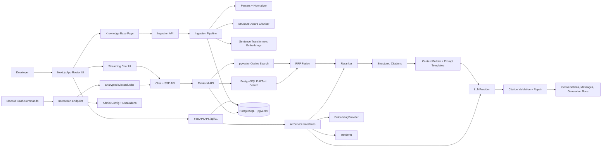

# GroundStack Architecture

## System Diagram

## Decisions

- The API is framework-independent below the route layer. Provider interfaces define future LLM, embedding, retrieval, and reranking boundaries without pulling in LangChain or LlamaIndex.
- PostgreSQL is the durable store for conversations and knowledge lineage. pgvector
  stores 384-dimensional chunk embeddings, and generated `tsvector` columns prepare
  for keyword retrieval.
- Status reporting uses real application configuration and a live `SELECT 1` database check. It avoids fabricated traffic, usage, or model metrics.
- The frontend is a serious developer-tool shell with a streaming chat surface,
  conversation history, source filters, Markdown rendering, code copy controls,
  and citation inspection. It shows API, retrieval, and LLM readiness from
  `/api/v1/system/status`.
- Tests cover each current endpoint. Database status behavior is unit-tested through dependency patching while the production code performs the real check.
- Ingestion is implemented as explicit stages outside API routes. API uploads,
  URL submissions, and CLI ingestion all delegate to the same orchestration service.
- FastAPI background tasks are acceptable only for local development in this phase;
  the orchestrator can be moved behind a durable queue without changing parsers,
  chunking, embeddings, or persistence contracts.
- Retrieval is explicit and framework-free. It combines pgvector cosine search,
  PostgreSQL text search, Reciprocal Rank Fusion, optional cross-encoder reranking,
  diversity selection, structured citations, and persisted diagnostics.
- Generation is explicit and framework-free. Prompt templates are versioned on disk,
  context packing is deterministic, LLM providers live behind `LLMProvider`, and
  generated answers are persisted with provider, model, prompt checksum, token usage,
  latency, finish reason, and citation links.
- Discord is an adapter, not a separate bot brain. Signed application-command
  interactions are verified by FastAPI, queued as encrypted jobs, answered through
  the same retrieval/reranking/generation/citation-validation path, and rendered
  with Discord-specific limits and mention suppression.

## Ingestion Flow

1. Validate the submitted file or URL source.
2. Extract content with the appropriate maintained parser.
3. Normalize Unicode, line endings, and whitespace while preserving code blocks.
4. Enrich metadata with parser name, parser version, source details, and checksums.
5. Chunk deterministically with heading paths, target token size, and overlap.
6. Generate normalized local embeddings with `BAAI/bge-small-en-v1.5`.
7. Persist source, immutable document version, chunks, and job state transactionally.
8. Skip unchanged re-ingestion by source and SHA-256 content checksum.

## Retrieval Flow

1. Validate and normalize the query without LLM rewriting.
2. Embed the query with the configured embedding provider.
3. Retrieve vector candidates with pgvector cosine distance.
4. Retrieve lexical candidates with PostgreSQL full-text search.
5. Fuse ranks with Reciprocal Rank Fusion.
6. Optionally rerank fused candidates with a lazy-loaded cross encoder.
7. Select diverse, deduplicated chunks and assign deterministic citations.
8. Persist retrieval diagnostics without logging raw query text by default.

## Generation Flow

1. Create or reopen a conversation and persist the user message idempotently.
2. Retrieve evidence with the same hybrid retrieval path used by `/retrieval/search`.
3. Return a deterministic insufficient-evidence answer when no source chunks are found.
4. Build a bounded context from recent completed messages and selected source chunks.
5. Render the configured prompt template and stream through the configured LLM provider.
6. Validate inline citations against the retrieved source IDs.
7. Attempt one repair pass for malformed, missing, or fabricated citations.
8. Persist the assistant message, generation run, token usage, and citation links.

## URL Security

Server-side URL ingestion accepts only explicitly submitted pages. It rejects embedded
credentials, non-HTTP schemes, non-allowlisted hostnames, redirects, unsupported content
types, oversized responses, and hostnames resolving to private, loopback, link-local,
multicast, reserved, or metadata-style addresses.

## Boundaries

- `app/api` owns HTTP routing and error translation.
- `app/core` owns configuration, logging, and exception types.
- `app/db` owns engine/session lifecycle and database checks.
- `app/models` owns SQLAlchemy models.
- `app/schemas` owns Pydantic response contracts.
- `app/services/ai` owns future model and retrieval interfaces only.
- `app/services/retrieval` owns query preparation, SQL retrieval, fusion, reranking,
  citation selection, evaluation, benchmarks, and diagnostics persistence.
- `app/services/ingestion` owns source adapters, parsers, normalization, chunking,
  embedding orchestration, persistence, and ingestion reports.
- `app/services/generation` owns prompt loading, context budgeting, citation
  validation, conversation persistence helpers, and grounded answer orchestration.
- `app/services/discord` owns signature verification, command parsing, privacy-safe
  identity, queued job persistence, Discord answer rendering, command-registration
  payload generation, and interaction-token encryption.
